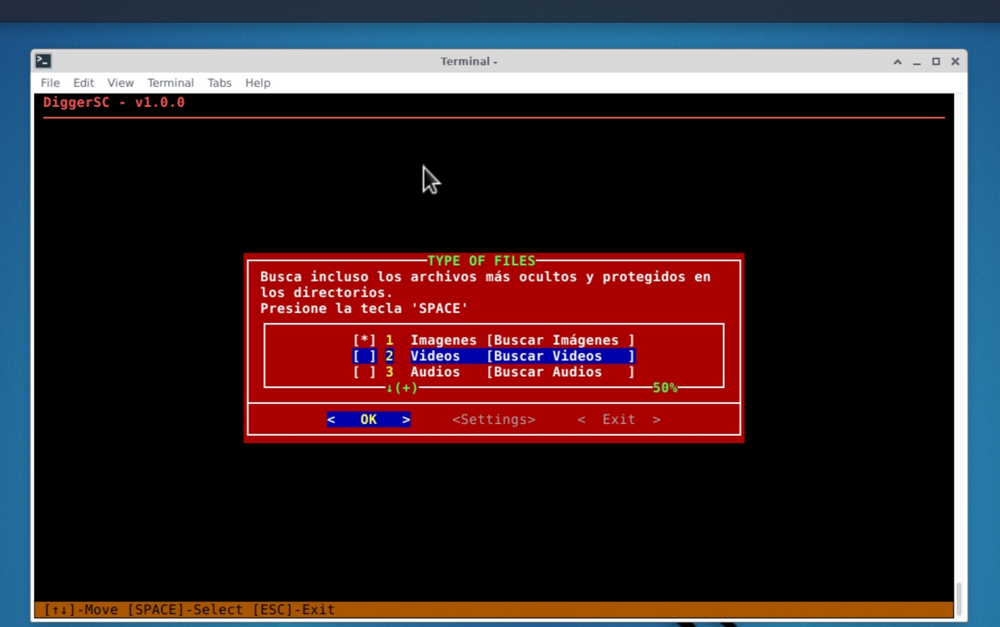

## Author : Z3R07-RED
## Version: 1.0.0

*****DiggerSC** It is a very powerful search engine and file collector. 
Find even the most hidden and protected files.

Previous requirements:
======
The following system-level utilities need to be installed:

```
apt-get install dialog file -y
```

```
apt-get install zip
```

Once installed, you can continue to the next point.

```
git clone https://github.com/Z3R07-RED/DiggerSC.git
```

USAGE:
======
* `cd DiggerSC/`
* `chmod +x DiggerSC.sh`
* `bash DiggerSC.sh`

<p align="center">

</p>

* Select the directories.

<p align="center">

</p>
